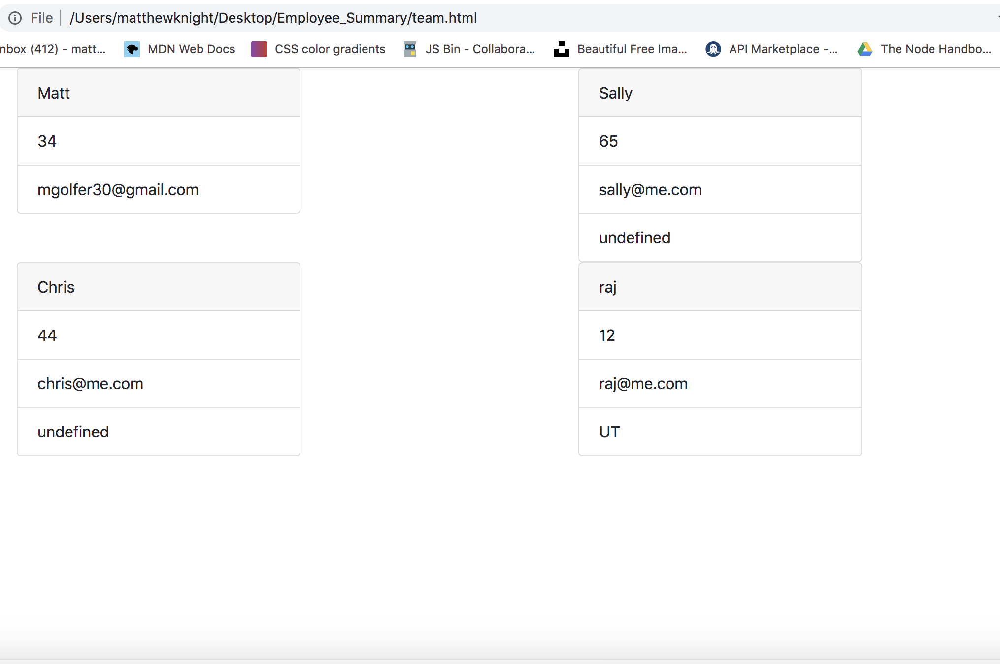

# Employee_Summary

Set up my directory

created my classes starting with the Employee class

started with a determineEmployee function to determine which employee it is,
then created a function for each employee type.

Each employee type asks the series of questions and adds those to the instantiation of the class.

When user types "finished", an html file is written using template literals.

Classes are tested.

